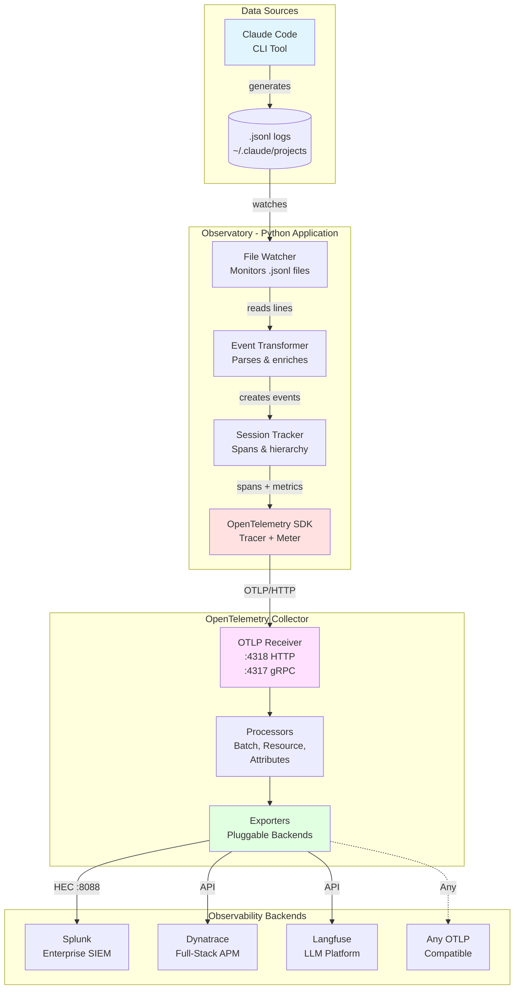

# Claude Code Observatory - Architecture

> **Enterprise-Grade OpenTelemetry Implementation for LLM Observability**

## Table of Contents
- [Overview](#overview)
- [Architecture Diagram](#architecture-diagram)
- [Data Flow](#data-flow)
- [Extensibility](#extensibility)
- [OpenTelemetry Best Practices](#opentelemetry-best-practices)
- [Adding New Backends](#adding-new-backends)

---

## Overview

Claude Code Observatory is a production-ready observability solution for monitoring Claude Code usage. It demonstrates:

✅ **OpenTelemetry Excellence** - Reference implementation following OTel standards
✅ **Vendor Neutrality** - Easy backend switching (Splunk, Dynatrace, Langfuse, etc.)
✅ **Extensibility** - Plugin architecture for new exporters
✅ **Enterprise-Grade** - Type-safe, validated, well-documented

---

## Architecture Diagram



---

## Data Flow

### Step-by-Step Execution

#### 1. **Data Generation**
```
Claude Code → .jsonl files
Location: ~/.claude/projects/{project}/{session-id}.jsonl
Format: JSONL (one JSON object per line)
```

**Sample JSONL:**
```json
{
  "type": "assistant",
  "sessionId": "abc-123",
  "message": {
    "model": "claude-sonnet-4-5-20250929",
    "usage": {
      "input_tokens": 1500,
      "output_tokens": 300,
      "cache_read_input_tokens": 5000
    },
    "content": [{"type": "text", "text": "Response..."}]
  }
}
```

#### 2. **File Watching** (`file_watcher.py`)
```python
ClaudeLogWatcher
├─ Monitors: ~/.claude/projects/**/*.jsonl
├─ Events: on_created, on_modified
└─ Triggers: process_file() on changes
```

#### 3. **Event Transformation** (`event_transformer.py`)
```python
JSONL Line → ClaudeEvent → OpenTelemetry Span

Extraction:
├─ Tokens: input, output, cache_creation, cache_read
├─ Cost: Calculate USD from token counts
├─ Content: Extract message text
├─ Tools: Extract tool name, input, result
└─ Session: Extract session_id, project_path, slug
```

#### 4. **Span Creation** (Following OTel Conventions)
```python
span.set_attribute("session.id", session_id)
span.set_attribute("tokens.total", total_tokens)
span.set_attribute("cost.usd", cost)
span.set_attribute("gen_ai.request.model", model_name)  # OTel standard
span.add_event("message.content", {"content.full": text})  # For large content
```

#### 5. **OTLP Export**
```python
Python App → OTLP/HTTP → Collector
Endpoint: http://localhost:4318/v1/traces
Protocol: OpenTelemetry Protocol (OTLP)
Format: Protobuf over HTTP
```

#### 6. **Collector Processing**
```yaml
receivers:
  otlp:
    protocols:
      http: :4318

processors:
  - batch          # Group spans for efficiency
  - resource       # Add service metadata
  - attributes     # Transform/enrich

exporters:
  splunk_hec:      # → Splunk
  otlp/dynatrace:  # → Dynatrace
  otlp/langfuse:   # → Langfuse
```

#### 7. **Backend Storage**
- **Splunk**: HEC → Index → Searchable via SPL
- **Dynatrace**: OTLP API → Davis AI → Dashboards
- **Langfuse**: Custom API → Traces → Evaluations

---

## Extensibility

### Key Design Principles

1. **Separation of Concerns**
   - Python: Data collection & transformation
   - Collector: Routing & backend integration
   - Backend: Storage & analysis

2. **Plugin Architecture**
   - Exporters as plugins
   - Registry pattern for discovery
   - Factory pattern for creation

3. **Configuration-Driven**
   - Add new backend → Update YAML
   - No code changes required
   - Multiple simultaneous backends

### Current Implementation

```python
# Python code is backend-agnostic!
from opentelemetry.exporter.otlp.proto.http.trace_exporter import OTLPSpanExporter

exporter = OTLPSpanExporter(
    endpoint="http://localhost:4318/v1/traces"  # Just OTLP endpoint
)
```

**Backend selection happens in Collector config:**
```yaml
exporters:
  splunk_hec:  # Active
    endpoint: "http://localhost:8088/services/collector"
    token: "${SPLUNK_HEC_TOKEN}"

  otlp/dynatrace:  # Easy to add
    endpoint: "https://{env-id}.live.dynatrace.com/api/v2/otlp"
    headers:
      Authorization: "Api-Token ${DT_API_TOKEN}"
```

---

## OpenTelemetry Best Practices

### ✅ What We Do Right

#### 1. **Semantic Conventions**
```python
# Following gen_ai.* conventions
span.set_attribute("gen_ai.request.model", "claude-sonnet-4-5")
span.set_attribute("gen_ai.response.finish_reasons", "end_turn")

# Following llm.* conventions (OpenInference)
span.set_attribute("llm.token_count.total", 1800)
span.set_attribute("llm.token_count.prompt", 1500)
span.set_attribute("llm.token_count.completion", 300)
```

#### 2. **Resource Attributes**
```python
Resource.create({
    "service.name": "claude-code-observatory",
    "service.version": "1.0.0",
    "deployment.environment": "production",
    "telemetry.sdk.name": "opentelemetry",
    "telemetry.sdk.language": "python"
})
```

#### 3. **Span Hierarchy**
```
Session Span (root)
├─ User Message Span
├─ Assistant Response Span
│  ├─ Tool Use Span (Read)
│  ├─ Tool Result Span
│  └─ Tool Use Span (Write)
└─ User Message Span
```

#### 4. **Span Events for Large Data**
```python
# Attributes: Small, indexed data
span.set_attribute("tokens.total", 1800)

# Events: Large, non-indexed data
span.add_event("message.content", {
    "content.full": "...10KB of text..."  # No truncation!
})
```

#### 5. **Batch Processing**
```python
BatchSpanProcessor(
    exporter,
    max_queue_size=2048,
    schedule_delay_millis=5000,  # Batch every 5s
    max_export_batch_size=512
)
```

---

## Adding New Backends

### Option 1: Collector Configuration (Recommended)

**Example: Adding Datadog**

1. **Update collector config:**
```yaml
exporters:
  datadog:
    api:
      key: "${DD_API_KEY}"
      site: "datadoghq.com"

service:
  pipelines:
    traces:
      receivers: [otlp]
      processors: [batch, resource]
      exporters: [splunk_hec, datadog]  # Add here
```

2. **Restart collector:**
```powershell
Restart-Service otelcol
```

**That's it!** Python code unchanged.

---

### Option 2: Direct Python Exporter (Advanced)

**When to use:**
- Custom transformation logic per backend
- Direct export without collector
- Backend-specific features not in collector

**Example: Langfuse Direct Exporter**

```python
# 1. Create exporter class
from claude_monitor.telemetry.exporters.base import BaseExporter

class LangfuseExporter(BaseExporter):
    name = "langfuse"

    def _initialize(self):
        from langfuse import Langfuse
        self.client = Langfuse(
            public_key=self._config["public_key"],
            secret_key=self._config["secret_key"]
        )

    def get_span_processor(self):
        return LangfuseSpanProcessor(self.client)

# 2. Register exporter
from claude_monitor.telemetry.exporters import register_exporter
register_exporter(LangfuseExporter)

# 3. Configure
config = {
    "exporters": [
        {
            "name": "langfuse",
            "enabled": True,
            "config": {
                "public_key": "pk-lf-...",
                "secret_key": "sk-lf-..."
            }
        }
    ]
}
```

---

## Backend Comparison

| Backend | Use Case | Data Flow | Effort |
|---------|----------|-----------|--------|
| **Splunk** | Enterprise SIEM, compliance, logs | Collector → HEC | ✅ Working |
| **Dynatrace** | Full-stack APM, auto-discovery | Collector → OTLP API | 🟡 Collector config |
| **Langfuse** | LLM-specific, evals, prompts | Direct or Collector | 🟡 Custom exporter |
| **Datadog** | APM, infrastructure, dashboards | Collector → DD Agent | 🟡 Collector config |
| **New Relic** | APM, distributed tracing | Collector → OTLP API | 🟡 Collector config |
| **Honeycomb** | Observability, high-cardinality | Collector → OTLP API | 🟡 Collector config |

**Key Insight:** Most backends work via Collector config changes only!

---

## Performance Considerations

### Optimizations Implemented

1. **Batch Processing**
   - Spans grouped before export
   - Reduces network overhead
   - Configurable batch size/timeout

2. **Async File Watching**
   - Non-blocking I/O
   - Processes multiple files concurrently
   - Incremental reading (not re-reading entire file)

3. **Memory Management**
   - Session cleanup after 24h inactivity
   - Bounded span queue
   - Memory limiter in Collector

4. **Selective Sampling**
   - Configurable trace sampling (0.0-1.0)
   - Always sample errors
   - Head-based sampling for high-volume

### Typical Performance

| Metric | Value |
|--------|-------|
| Latency Added | <10ms per message |
| Memory Overhead | ~50MB for 100 sessions |
| CPU Overhead | <5% on modern CPU |
| Network | ~1KB per span (compressed) |

---

## Security Considerations

### Implemented Safeguards

1. **Secrets Management**
   - Tokens from environment variables
   - Never logged or included in spans
   - Collector handles authentication

2. **Content Privacy**
   - Optional content redaction
   - PII filtering (if enabled)
   - Configurable content truncation

3. **Network Security**
   - TLS for prod (configurable)
   - Local-only by default
   - No external calls without config

---

## Troubleshooting

### Common Issues

**Issue: No data in Splunk**
```bash
# Check collector
curl http://localhost:13133  # Health check
curl http://localhost:8888/metrics | grep receiver_accepted

# Check HEC
curl http://localhost:8088/services/collector/health
```

**Issue: High memory usage**
```yaml
# Adjust collector config
processors:
  memory_limiter:
    limit_mib: 256  # Reduce if needed
    spike_limit_mib: 64
```

**Issue: Missing attributes**
```python
# Check semantic conventions
from claude_monitor.telemetry import semantic_conventions as sc
span.set_attribute(sc.TOKENS_TOTAL, tokens)  # Use constants
```

---

## Future Enhancements

- [ ] Rate limit tracking (if Claude API exposes this)
- [ ] Automatic dashboard provisioning
- [ ] Distributed tracing across multiple sessions
- [ ] A/B testing framework integration
- [ ] Cost optimization recommendations
- [ ] Anomaly detection integration

---

## References

- [OpenTelemetry Specification](https://opentelemetry.io/docs/specs/otel/)
- [Semantic Conventions](https://opentelemetry.io/docs/specs/semconv/)
- [OpenInference for LLMs](https://github.com/Arize-ai/openinference)
- [Splunk OTel Collector](https://github.com/signalfx/splunk-otel-collector)
